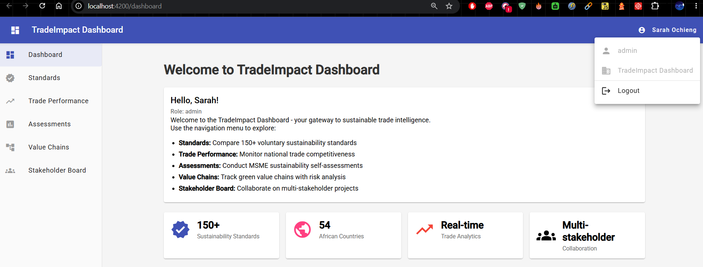
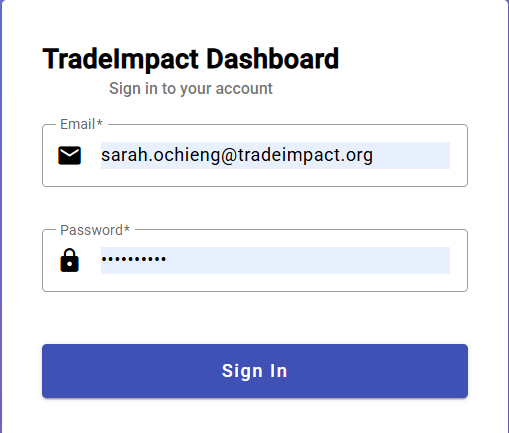
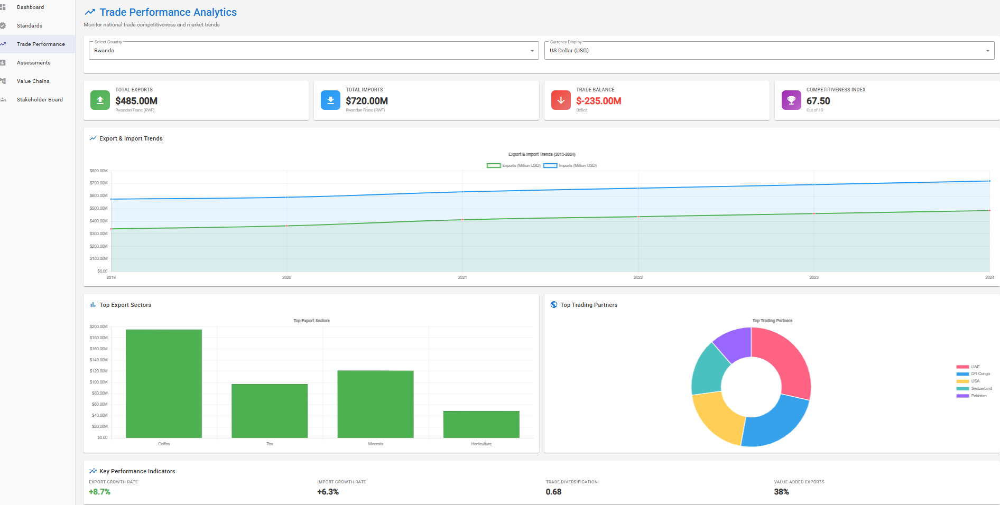
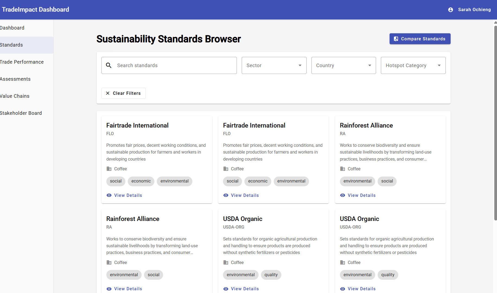
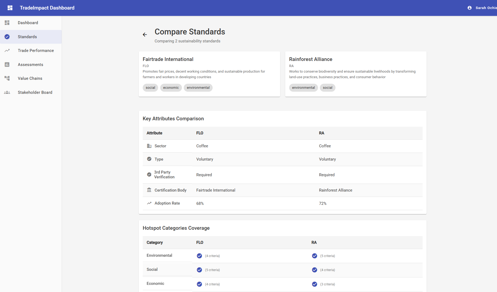
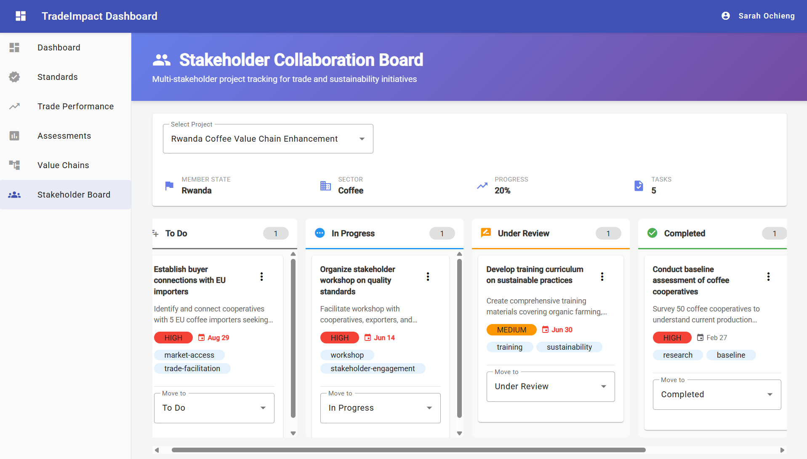

# TradeImpact Dashboard


**Last Updated:** June 5, 2026

A **multi-stakeholder sustainability trade intelligence platform** for MSMEs and policymakers, inspired by ITC's T4SD (Trade for Sustainable Development) and GIVC (Green & Inclusive Value Chains) programmes.

---

## 🌍 Overview

TradeImpact Dashboard empowers **Micro, Small, and Medium Enterprises (MSMEs)** and **policy analysts** in developing countries to:

- **Compare Voluntary Sustainability Standards (VSS)** across sectors and countries
- **Monitor national trade performance** with competitiveness metrics and recovery indicators
- **Conduct sustainability self-assessments** against international standards
- **Track green value chains** with risk hotspot analysis
- **Collaborate on multi-stakeholder projects** for sustainable trade transformation

This platform mirrors the work done by the **International Trade Centre (ITC)** in their Trade for Sustainable Development (T4SD) and Green & Inclusive Value Chains (GIVC) programmes, supporting the Sustainable Development Goals (SDGs) and climate-resilient trade in Africa and beyond.

---

## 🎬 Visual Journey

### Watch the Dashboard in Action

Experience the full potential of TradeImpact Dashboard through our comprehensive demo video:

[](https://github.com/JuniorDieka/TradeImpact-Dashboard/releases/tag/v1.0)

> **🎥 Video Highlights** (1:00 min):
> - 👤 Multi-role authentication (Admin, Policy Analyst, MSME User, Stakeholder)
> - 📊 Interactive trade analytics with real-time charts
> - ✅ Standards comparison across sectors and countries
> - 🔄 Collaborative project management with Kanban boards
> - 🔒 Dynamic role-based navigation and security
> - 🎨 Elegant Material Design user experience

---

### 📸 A User's Journey Through TradeImpact

<details open>
<summary><b>Explore the Platform Step by Step</b></summary>

#### 🔐 Step 1: Secure Access



**Starting Point**: Users authenticate with their organizational credentials. The system recognizes their role (Admin, Policy Analyst, MSME User, or Stakeholder) and tailors the entire experience accordingly.

---

#### 🏠 Step 2: Personalized Dashboard


**Command Center**: Upon login, users land on a personalized dashboard showing relevant metrics, quick actions, and role-specific insights. Admins see system-wide statistics, while MSME users focus on their sustainability journey.

---

#### 📊 Step 3: Trade Performance Intelligence



**Data-Driven Insights**: Policy analysts and MSME users explore interactive charts showing export/import trends, sector breakdowns, and trade competitiveness indicators. Select member states, filter by quarters, and track recovery metrics with Chart.js visualizations.

---

#### ✅ Step 4: Sustainability Standards Discovery



**Standards Library**: Browse 150+ voluntary sustainability standards (VSS) filtered by sector, country, and hotspot categories. Each standard displays detailed certification requirements, inspired by ITC's Standards Map.

---

#### ⚖️ Step 5: Side-by-Side Comparison



**Decision Support**: Compare multiple standards simultaneously to identify the best fit for your business or policy needs. View criteria breakdowns, sector applicability, and country coverage in a clear comparison matrix.

---

#### 👥 Step 6: Collaborative Action



**Multi-Stakeholder Coordination**: Government officials, business support organizations, and private sector stakeholders collaborate on sustainability projects. The Kanban board tracks tasks across 5 status columns (Backlog → To Do → In Progress → Review → Done) with priority levels, assignments, and real-time Material Design notifications.

---

**🚀 Ready to Experience It Yourself?** [Jump to Getting Started](#getting-started)

</details>

---

## ✨ Features

### ✅ **Currently Implemented (v1.0)**

#### 🔐 **Authentication & Role-Based Access Control**
- JWT-based authentication with secure token management
- 4 user roles: Admin, Policy Analyst, MSME User, Stakeholder
- International security compliance (NIST 800-53, ISO 27001, SOC 2)
- Role-based UI navigation and API endpoint protection

#### 🏠 **Dashboard & Landing Page**
- Personalized user dashboard with role-based metrics
- User profile management
- Modern Material Design interface

#### 1. **Sustainability Standards Browser** ✅
- Search and filter 150+ voluntary sustainability standards (VSS) by sector, country, and hotspot category
- Compare standards side-by-side with detailed criteria breakdowns
- Detailed standard information pages
- Mirror functionality of ITC's **Standards Map**

#### 2. **National Trade Performance Monitor** ✅
- Real-time trade competitiveness dashboards per country
- Export/import trend analysis with interactive Chart.js visualizations
- Member state selection (Rwanda, Kenya, Ethiopia, Uganda, etc.)
- Sector-level breakdown with quarterly data tracking

#### 3. **Stakeholder Collaboration Board** ✅
- Multi-stakeholder project management (Ministries, BSOs, Private Sector)
- Kanban-style task board with 5 status columns (Backlog, To Do, In Progress, Review, Done)
- Task assignment with priority levels and due dates
- Material Design notifications for all actions
- Project and task filtering
- Reflects UNECA-style client coordination workflows

---

### 🚧 **Coming Soon** (Backend APIs Ready)

#### 4. **MSME Sustainability Self-Assessment** 🔜
- Multi-step assessment form across 5 dimensions (environmental, social, economic, quality, ethics)
- Automated gap analysis and sustainability scoring
- **Downloadable roadmap** with prioritized recommendations and cost estimates
- Inspired by T4SD diagnostic tools
- *Status: Backend complete, frontend UI in development*

#### 5. **Green Value Chain Tracker** 🔜
- Visualize end-to-end value chains from production to market
- Identify sustainability risk hotspots at each stage
- Compliance status tracking and mitigation action planning
- Aligned with GIVC **Alliances for Action (A4A)** methodology
- *Status: Backend complete, frontend UI in development*

---

## 🛠 Tech Stack

### **Backend**
- **Framework**: NestJS 10.x (Node.js)
- **Database**: MongoDB 7.x with Mongoose ODM
- **Authentication**: JWT with role-based access control (RBAC)
- **API Documentation**: Swagger/OpenAPI auto-generated
- **Validation**: class-validator + class-transformer
- **Security**: bcrypt password hashing, CORS, environment variables

### **Frontend**
- **Framework**: Angular 17.x
- **UI Library**: Angular Material (Material Design)
- **Charts**: Chart.js with ng2-charts wrapper
- **State Management**: RxJS Observables
- **Routing**: Angular Router with lazy-loaded modules
- **HTTP**: HttpClient with interceptors for JWT and error handling

### **Development Tools**
- **Language**: TypeScript 5.x (strict mode)
- **Package Managers**: npm
- **Code Quality**: ESLint, Prettier
- **Version Control**: Git

---

## 🏗 Architecture

### System Architecture Diagram

```
┌─────────────────────────────────────────────────────────────────┐
│                        FRONTEND (Angular 17)                     │
│  ┌────────────┬────────────┬────────────┬────────────────────┐  │
│  │  Auth      │ Standards  │   Trade    │   Assessments      │  │
│  │  Module    │  Module    │   Module   │   Module           │  │
│  ├────────────┼────────────┼────────────┼────────────────────┤  │
│  │ Value Chain│ Stakeholder│  Shared    │   Core Services    │  │
│  │  Module    │   Module   │  Module    │   (Auth, API)      │  │
│  └────────────┴────────────┴────────────┴────────────────────┘  │
│                              ▲                                   │
│                              │ HTTP/REST + JWT                   │
└──────────────────────────────┼───────────────────────────────────┘
                               │
                               ▼
┌─────────────────────────────────────────────────────────────────┐
│                     BACKEND (NestJS 10 + Express)               │
│  ┌────────────┬────────────┬────────────┬────────────────────┐  │
│  │  Auth      │ Standards  │  Country   │  Assessments       │  │
│  │  Module    │  Module    │   Trade    │  Module            │  │
│  │            │            │  Module    │                    │  │
│  ├────────────┼────────────┼────────────┼────────────────────┤  │
│  │ ValueChains│Stakeholders│  Common    │   Config           │  │
│  │  Module    │  Module    │  Utils     │   (JWT, DB)        │  │
│  └────────────┴────────────┴────────────┴────────────────────┘  │
│  Controllers → Services → Mongoose Models → MongoDB             │
│                              ▲                                   │
└──────────────────────────────┼───────────────────────────────────┘
                               │
                               ▼
                     ┌──────────────────┐
                     │  MongoDB Atlas   │
                     │  (Cloud/Local)   │
                     └──────────────────┘
```

### Data Flow

1. **User Authentication**: Login → JWT generation → Token stored in localStorage
2. **API Requests**: Angular services → HTTP Interceptor (attach JWT) → NestJS controllers
3. **Data Processing**: Controllers → Services → Mongoose models → MongoDB
4. **Error Handling**: Global exception filter → HTTP error interceptor → User notification
5. **Authorization**: JWT Strategy → Guards (Auth + Role) → Protected routes

---

## 🚀 Getting Started

### Prerequisites

- **Node.js**: v18.x or higher
- **npm**: v9.x or higher
- **MongoDB**: v7.x (local installation or MongoDB Atlas account)
- **Git**: Latest version

### Installation

#### 1. Clone the Repository

```bash
git clone https://github.com/JuniorDieka/TradeImpact-Dashboard.git
cd TradeImpact-Dashboard
```

#### 2. Complete Setup (One-Time)

```bash
npm run setup
```

This single command:
- Installs all dependencies (root, backend, frontend)
- Seeds the database with sample data

#### 3. Configure Environment Variables

Create a `.env` file in the `backend` directory:

```env
PORT=3000
NODE_ENV=development
FRONTEND_URL=http://localhost:4200

# MongoDB Connection
MONGODB_URI=mongodb://localhost:27017/tradeimpact-dashboard
# Or use MongoDB Atlas:
# MONGODB_URI=mongodb+srv://<username>:<password>@cluster.mongodb.net/tradeimpact-dashboard

# JWT Configuration
JWT_SECRET=your-super-secret-jwt-key-change-this-in-production
JWT_EXPIRATION=24h

# CORS
CORS_ORIGIN=http://localhost:4200
```

### Running the Application

#### Quick Start (Recommended)

**From the root directory:**

```bash
npm start
```

This automatically:
- ✅ Starts the backend server (`http://localhost:3000`)
- ✅ Starts the frontend dev server (`http://localhost:4200`)
- ✅ Shows all logs in one terminal with color-coded prefixes

**Note:** Database is already seeded from the setup step. No need to seed again!

**Test Credentials:**
- Admin: `sarah.ochieng@tradeimpact.org` / `Admin@2024`
- Policy Analyst: `jp.mukasa@gov.rw` / `Policy@2024`
- MSME User: `amina.hassan@kiganicoffee.rw` / `Coffee@2024`

#### Individual Commands

If you need more control:

```bash
# Re-seed database (only if you need to reset data)
npm run seed

# Start backend and frontend (same as npm start)
npm run dev

# Start backend only
npm run dev:backend

# Start frontend only
npm run dev:frontend
```

#### Other Useful Commands

```bash
# Build for production
npm run build

# Run tests
npm run test

# Lint code
npm run lint
```

### Access Points

- **Frontend**: `http://localhost:4200`
- **Backend API**: `http://localhost:3000/api`
- **API Documentation**: `http://localhost:3000/api/docs`

### Log Output

All logs appear in one terminal with color-coded prefixes:
- 🔵 **BACKEND** - Backend server logs, API requests, database operations
- 🟣 **FRONTEND** - Frontend build logs, compilation warnings, errors

Press `Ctrl+C` to stop all processes.

---

## 📁 Project Structure

```
TradeImpact-Dashboard/
├── backend/                    # NestJS backend application
│   ├── src/
│   │   ├── auth/              # Authentication module (JWT, guards, strategies)
│   │   ├── users/             # User management with roles
│   │   ├── standards/         # Sustainability standards CRUD
│   │   ├── country-trade/     # Trade performance data & analytics
│   │   ├── assessments/       # MSME self-assessments
│   │   ├── value-chains/      # Value chain tracking
│   │   ├── stakeholders/      # Collaboration board
│   │   ├── common/            # Shared utilities, filters, pipes
│   │   ├── app.controller.ts  # Health check endpoints
│   │   ├── app.module.ts      # Root module
│   │   └── main.ts            # Entry point with Swagger & CORS
│   ├── scripts/
│   │   └── seed.ts            # Database seeding script
│   ├── package.json
│   ├── tsconfig.json
│   ├── .env                   # MongoDB & JWT config (gitignored)
│   └── .env.example
│
├── frontend/                   # Angular 17 frontend application
│   ├── src/
│   │   ├── app/
│   │   │   ├── core/
│   │   │   │   ├── services/  # API, Auth, Currency, TradeData, Notification
│   │   │   │   ├── guards/    # Auth & Role guards
│   │   │   │   └── interceptors/ # JWT & Error interceptors
│   │   │   ├── shared/
│   │   │   │   ├── models/    # TypeScript interfaces (User, TradeData, Currency, etc.)
│   │   │   │   └── pipes/     # NumberFormat pipe
│   │   │   ├── features/
│   │   │   │   ├── auth/              # Login & Register
│   │   │   │   ├── dashboard/         # Main dashboard
│   │   │   │   ├── trade-performance/ # Charts with currency localization
│   │   │   │   ├── standards/         # VSS browser
│   │   │   │   ├── assessments/       # Self-assessment forms
│   │   │   │   ├── value-chains/      # Value chain visualizer
│   │   │   │   └── stakeholder-board/ # Collaboration tools
│   │   │   ├── layout/        # Header, sidebar components
│   │   │   ├── app.module.ts
│   │   │   └── app-routing.module.ts
│   │   ├── environments/      # Development & production configs
│   │   ├── assets/
│   │   └── styles.scss        # Global styles with Material theme
│   ├── angular.json
│   ├── package.json
│   └── tsconfig.json
│
├── package.json               # Root workspace with unified dev scripts
├── .gitignore                 # Excludes .env.atlas, node_modules, build outputs
├── .nvmrc                     # Node version 18.0.0
├── README.md                  # This file
├── docs/
│   ├── DEVELOPMENT.md         # Comprehensive development guide
│   ├── STRUCTURE.md           # Detailed folder structure documentation
│   ├── RBAC_IMPLEMENTATION.md # Security and access control documentation
│   ├── GITHUB_RELEASE.md      # GitHub release template
│   ├── screenshots/           # Application screenshots
│   └── videos/                # Video demo hosting instructions
└── package.json               # Root workspace configuration
```

---

## 📚 API Documentation

Once the backend is running, visit:

**Swagger UI**: [http://localhost:3000/api/docs](http://localhost:3000/api/docs)

### Key Endpoints

| Method | Endpoint | Description |
|--------|----------|-------------|
| `POST` | `/api/auth/register` | Register new user |
| `POST` | `/api/auth/login` | Login and get JWT |
| `GET` | `/api/auth/profile` | Get current user profile |
| `GET` | `/api/standards` | Get all standards (with filters) |
| `GET` | `/api/standards/compare?ids=...` | Compare standards |
| `GET` | `/api/country-trade` | Get trade data |
| `GET` | `/api/country-trade/trends/:memberState` | Get trade trends |
| `POST` | `/api/assessments` | Create MSME assessment |
| `GET` | `/api/assessments/:id/roadmap` | Get improvement roadmap |
| `POST` | `/api/value-chains` | Create value chain tracker |
| `GET` | `/api/value-chains/:id/hotspots` | Get hotspot analysis |
| `GET` | `/api/stakeholders/projects` | Get all projects |
| `POST` | `/api/stakeholders/tasks` | Create task |

All protected endpoints require:
```
Authorization: Bearer <JWT_TOKEN>
```

---

## 🚢 Deployment

### Backend Deployment (Heroku/Railway/Render)

1. Set environment variables in deployment platform
2. Ensure MongoDB Atlas connection string is configured
3. Deploy backend:
   ```bash
   npm run build
   npm run start:prod
   ```

### Frontend Deployment (Netlify/Vercel)

1. Update `environment.prod.ts` with production API URL
2. Build for production:
   ```bash
   npm run build
   ```
3. Deploy `dist/` folder

### MongoDB Atlas Setup

1. Create a free cluster at [mongodb.com/cloud/atlas](https://www.mongodb.com/cloud/atlas)
2. Add database user and whitelist IP addresses
3. Copy connection string to `.env`

---

## 🤝 Contributing

Contributions are welcome! Please follow these steps:

1. Fork the repository
2. Create a feature branch (`git checkout -b feature/amazing-feature`)
3. Commit your changes (`git commit -m 'Add amazing feature'`)
4. Push to the branch (`git push origin feature/amazing-feature`)
5. Open a Pull Request

---

## 📄 License

This project is licensed under the MIT License - see the [LICENSE](LICENSE) file for details.

---

##  Acknowledgments

- **ITC T4SD Programme** - Inspiration for sustainability standards and MSME tools
- **ITC GIVC** - Methodology for green value chain tracking
- **UNECA** - Trade competitiveness and recovery metrics frameworks
- **Standards Map** - Reference for VSS database structure
- **Alliances for Action (A4A)** - Multi-stakeholder collaboration approach

---

**Built with ❤️ for sustainable and inclusive trade transformation in developing countries**
