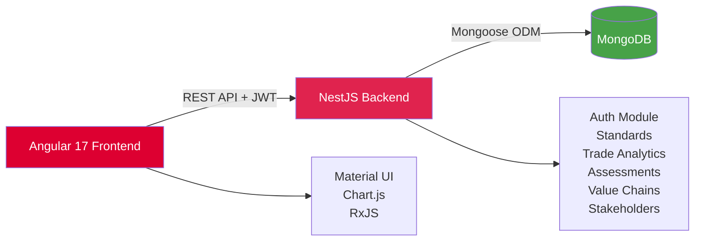

# TradeImpact Dashboard


> **⚠️ Educational Portfolio Project** — Not affiliated with any organization. Built for technical demonstration purposes using publicly available sustainable trade frameworks.

A full-stack **sustainability trade intelligence platform** for MSMEs and policy analysts, featuring standards comparison, trade analytics, stakeholder collaboration, and sustainability assessments.

[](https://github.com/JuniorDieka/TradeImpact-Dashboard/releases/tag/v1.0)

## ✨ Key Features

- 🔐 **JWT Authentication** with role-based access (Admin, Policy Analyst, MSME, Stakeholder)
- 📊 **Trade Performance Analytics** with interactive Chart.js visualizations
- ✅ **Standards Browser** — Compare 150+ sustainability standards side-by-side
- 👥 **Kanban Collaboration Board** — Multi-stakeholder project management
- 📋 **Self-Assessment Tools** — MSME sustainability gap analysis (backend ready)
- 🌱 **Value Chain Tracker** — Risk hotspot identification (backend ready)

## 📸 Screenshots

<details>
<summary><b>View Application Screenshots</b></summary>

| Login | Dashboard | Trade Analytics |
|-------|-----------|-----------------|
|  |  |  |

| Standards Browser | Comparison | Collaboration Board |
|-------------------|------------|---------------------|
|  |  |  |

</details>

## � Tech Stack

**Backend:** NestJS 10 • MongoDB 7 • JWT Auth • Swagger API  
**Frontend:** Angular 17 • Material Design • Chart.js • RxJS  
**DevOps:** TypeScript 5 • npm • ESLint • Git

## 🏗 Architecture



## 🚀 Quick Start

### Prerequisites
Node.js 18+ • MongoDB 7+ • npm 9+

### Installation

```bash
# Clone and setup
git clone https://github.com/JuniorDieka/TradeImpact-Dashboard.git
cd TradeImpact-Dashboard
npm run setup  # Installs dependencies + seeds database

# Configure backend/.env
MONGODB_URI=mongodb://localhost:27017/tradeimpact-dashboard
JWT_SECRET=your-secret-key
PORT=3000

# Start application
npm start  # Runs backend + frontend concurrently
```

### Access
- **Frontend:** http://localhost:4200
- **API:** http://localhost:3000/api
- **Swagger Docs:** http://localhost:3000/api/docs

### Demo Credentials
- **Admin:** sarah.ochieng@tradeimpact.org / Admin@2024
- **Policy Analyst:** jp.mukasa@gov.rw / Policy@2024
- **MSME User:** amina.hassan@kiganicoffee.rw / Coffee@2024

## 📁 Project Structure

```
TradeImpact-Dashboard/
├── backend/src/               # NestJS modules
│   ├── auth/                  # JWT authentication & RBAC
│   ├── standards/             # VSS browser & comparison
│   ├── country-trade/         # Trade analytics
│   ├── assessments/           # MSME self-assessments
│   ├── value-chains/          # Value chain tracker
│   └── stakeholders/          # Collaboration board
├── frontend/src/app/          # Angular modules
│   ├── core/                  # Services, guards, interceptors
│   ├── features/              # Feature modules (auth, dashboard, etc.)
│   ├── shared/                # Models, pipes, utilities
│   └── layout/                # Header, sidebar
└── docs/                      # Documentation & screenshots
```

## 📚 API Documentation

**Swagger UI:** http://localhost:3000/api/docs

Key endpoints: `/api/auth/*`, `/api/standards/*`, `/api/country-trade/*`, `/api/assessments/*`, `/api/value-chains/*`, `/api/stakeholders/*`

All protected routes require: `Authorization: Bearer <JWT_TOKEN>`

## 🚢 Deployment

**Backend:** Heroku/Railway/Render → Set env vars → `npm run build && npm run start:prod`  
**Frontend:** Netlify/Vercel → Update `environment.prod.ts` → `npm run build` → Deploy `dist/`  
**Database:** MongoDB Atlas (free tier available)

## 📄 License

MIT License — See [LICENSE](LICENSE) file

---

## 📖 Acknowledgments

Conceptual inspiration from publicly available sustainable trade frameworks (T4SD, GIVC), development economics metrics, and multi-stakeholder collaboration methodologies.

**⚖️ Disclaimer:** Educational portfolio project. Not affiliated with any organization. No proprietary data used. Not for production use in policy/business decisions.

---

**Built with ❤️ by [Junior Dieka](https://github.com/JuniorDieka) as a full-stack technical demonstration**
